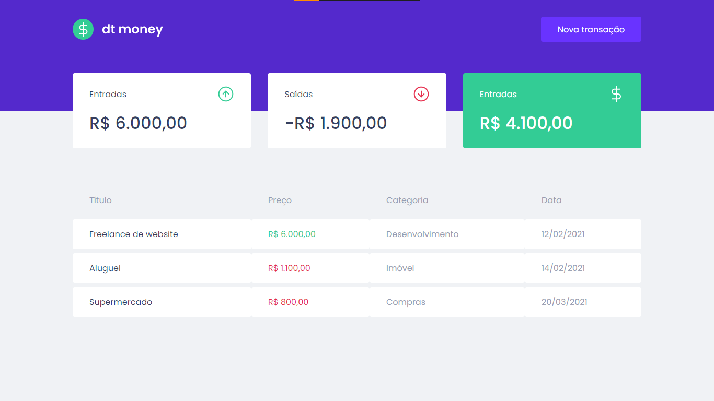
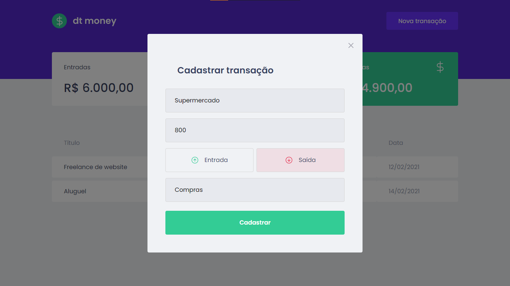

<div class="bg-gray-dark">
  <h1 align="center">
    <div class="bg-gray-dark">
    
    </div>
  </h1>
</div>

<p align="center">
  <a href="https://www.linkedin.com/in/samuel-macedo-12a420a8">
    
  </a>

  

  <a href="https://github.com/Samuca-sys/dtmoney/commits/main">
    
  </a>

  
</p>

## :pushpin: Menu
<!-- -->  
- [:one: About](#one-about)
- [:two: Technologies](#two-technologies)
- [:camera: Screenshot](#computer-screenshots)
- [:computer: How to run](#camera-how-to-run)
- [:closed_book: License](#closed_book-license)

## :one: About
Web app to manage your deposits and withdraws using a simulated api, made for the second chapter of [RocketSeat Ignite](https://rocketseat.com.br/)

## :two: Technologies
This project was made using the following technologies:

* [Typescript](https://www.typescriptlang.org/)
* [ReactJS](https://pt-br.reactjs.org/)
* [Webpack](https://webpack.js.org/)
* [Babel](https://babeljs.io/)
* [Styled Component](https://styled-components.com/)
* [MirageJs](https://miragejs.com/)
  
## :camera: Screenshots
<div style="display: flex; flex-direction: 'row'; align-items: 'center';">
  
  
</div>

## :computer: How to run

```bash
# Clone o Repositório
$ git clone https://github.com/Samuca-sys/dtmoney
```

```bash
# Vá para a pasta do projeto
$ cd dtmoney

# Instale as depedencias
$ yarn install

# Rode a aplicação
$ yarn start
```
Available application url: http://localhost:3000/

## :closed_book: License

Released in 2021 :closed_book: License

Made by [Samuel Macedo](https://github.com/Samuca-sys) 🚀.
This project has [MIT license](./LICENSE).
